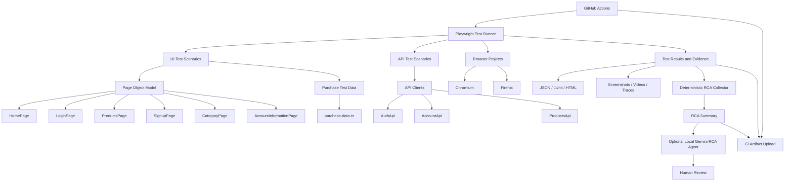


# QA Automation Framework - Architecture

```mermaid
flowchart TB
    GH["GitHub Actions"]
    TR["Playwright Test Runner"]
    UI["UI Test Scenarios"]
    API["API Test Scenarios"]

    GH --> TR
    TR --> UI
    TR --> API

    UI --> POM["Page Object Model"]
    POM --> HP["HomePage"]
    POM --> LP["LoginPage"]
    POM --> PP["ProductsPage"]
    POM --> SP["SignupPage"]
    POM --> CP["CategoryPage"]
    POM --> AIP["AccountInformationPage"]

    API --> AC["API Clients"]
    AC --> AUTH["AuthApi"]
    AC --> ACC["AccountApi"]
    AC --> PROD["ProductsApi"]

    UI --> FIX["Purchase Test Data"]
    FIX --> PD["purchase-data.ts"]

    TR --> BROWSERS["Browser Projects"]
    BROWSERS --> CH["Chromium"]
    BROWSERS --> FF["Firefox"]

    TR --> RESULTS["Test Results and Evidence"]
    RESULTS --> REPORTS["JSON / JUnit / HTML"]
    RESULTS --> MEDIA["Screenshots / Videos / Traces"]

    RESULTS --> COLLECTOR["Deterministic RCA Collector"]
    COLLECTOR --> SUMMARY["RCA Summary"]

    SUMMARY --> AGENT["Optional Local Gemini RCA Agent"]
    AGENT --> REVIEW["Human Review"]

    GH --> UPLOAD["CI Artifact Upload"]
    RESULTS --> UPLOAD
    SUMMARY --> UPLOAD
```
